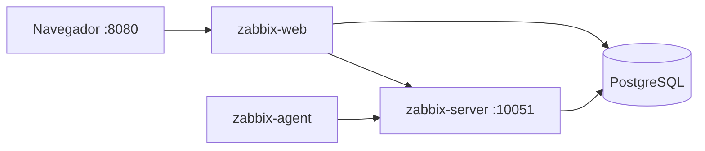

# Zabbix on Docker (PostgreSQL)

Lab / homelab stack: **Zabbix 7.0 LTS** with **PostgreSQL**, installed with two scripts on Debian. Built to stand up monitoring without a from-scratch Zabbix install every time.

**English:** clone, copy `env.example` → `.env`, on Debian 11–13 run `sudo ./prepare.sh` then `./install.sh`. Full ops guide (Spanish): [INSTRUCCIONES.md](INSTRUCCIONES.md).

---

## Qué resuelve

Instalar Zabbix a mano implica paquetes, schema SQL, PHP y Nginx. Aquí el host solo necesita Debian y Docker; el resto va en contenedores. Sirve para portafolio de **sysadmin / DevOps**: Compose, secretos en `.env`, backups con cron, rotación de clave de BD y un wipe controlado.

No es el repositorio oficial `zabbix/zabbix-docker` (ese es enorme). Este repo es un stack mínimo automatizado.



## Stack

| Pieza | Imagen |
| --- | --- |
| Base de datos | `postgres:16-alpine` |
| Zabbix server | `zabbix/zabbix-server-pgsql:alpine-7.0-latest` |
| Frontend | `zabbix/zabbix-web-nginx-pgsql:alpine-7.0-latest` |
| Agente del propio server | `zabbix/zabbix-agent2:alpine-7.0-latest` |

Zabbix va en **contenedores**: la versión de Debian del host no cambia la de Zabbix, siempre que Docker funcione.

## Debian: no es cualquier versión

`prepare.sh` instala Docker desde el **repo oficial de Docker**, no desde `docker.io` de Debian.

| Debian | Codenombre | `prepare.sh` |
| --- | --- | --- |
| 13 | trixie | Sí (probado como objetivo, p. ej. 13.6) |
| 12 | bookworm | Sí |
| 11 | bullseye | Sí |
| 10 o anterior | buster, … | No |
| Ubuntu, Fedora, etc. | — | No (el script exige `ID=debian`) |
| Testing / Sid | — | No |

Compose (`install.sh`, backups, wipe) corre en **cualquier Linux con Docker Engine + plugin Compose**. Lo atado a Debian es solo `prepare.sh`.

En macOS o Windows usa Docker Desktop y salta `prepare.sh`.

## Inicio rápido (Debian 11–13)

```bash
cp env.example .env
# edita POSTGRES_PASSWORD (y deja POSTGRES_DB=zabbix)

chmod +x *.sh
sudo ./prepare.sh
# cierra sesión SSH y vuelve a entrar (grupo docker)

./install.sh
```

Web: `http://IP-DEL-SERVER:8080` — usuario `Admin`, contraseña `zabbix` (cámbiala en la UI). Eso **no** es la clave de PostgreSQL.

Guía operativa completa: **[INSTRUCCIONES.md](INSTRUCCIONES.md)** (contraseñas, backups, apagado del server, wipe, restauración).

## Scripts

| Script | Función |
| --- | --- |
| `prepare.sh` | Docker Engine + Compose en Debian 11–13 |
| `install.sh` | Pull + up / down / logs / status / reset del volumen |
| `backup.sh` | Dump de Postgres a `backups/*.sql.gz` **en el mismo server** |
| `schedule-backup.sh` | Cron; se puede repetir y **reemplaza** el horario anterior |
| `change-db-password.sh` | Rota la clave de Postgres **sin** borrar datos |
| `wipe.sh` | Limpieza si algo sale mal (datos / dumps / imágenes) |

## Contraseñas

Hay dos:

1. **PostgreSQL** — `POSTGRES_USER`, `POSTGRES_PASSWORD`, `POSTGRES_DB` en `.env`. Las tres tienen que coincidir en Postgres, server y web. `POSTGRES_DB` es el **nombre** de la base (`zabbix`), no la contraseña.
2. **Web** — `Admin` / `zabbix`. Zabbix la crea al inicializar el schema; no es variable de Docker.

Si el stack ya arrancó, no cambies solo `.env` para rotar Postgres: usa `./change-db-password.sh`.

**No subas `.env` a git.** Está en `.gitignore`. El repo lleva `env.example` (sin punto al inicio, para que se vea en Finder).

## Backups

Quedan en el Debian, en `backups/zabbix-AAAAMMDD-HHMMSS.sql.gz` (dump SQL gzip, no el volumen Docker). Detalle: [INSTRUCCIONES.md](INSTRUCCIONES.md#dónde-se-guardan).

## Apagar el servidor

Un `sudo shutdown -h now` basta. No hace falta parar Docker a mano. Con `restart: unless-stopped` los contenedores vuelven al encender. Evita cortes de corriente.

## Licencia

[MIT](LICENSE). Zabbix y las imágenes oficiales tienen sus propias licencias.
